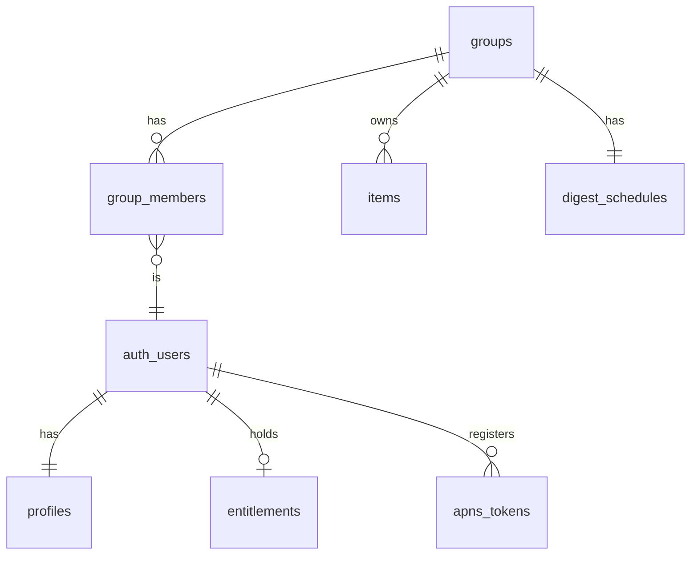

# Launch-Ready Transition Plan

Transition CanWeGo from a two-person allow-listed app to a launchable product:
group-based data model (solo to 4 people), Sign in with Apple, a
4-items-per-category free tier with a subscription unlock, usable from any
city in the world, and the surrounding launch essentials — without disturbing
the existing Can + Joyce library.

*Drafted 25 Aug 2026. Re-cut 4 Sep 2026 for the smallest launchable slice:
Apple-only sign-in, home location instead of city editions, two-rule
membership, invite codes first, on-device-verified Plus. Everything cut is
parked in the post-launch backlog at the end. Phase 0 starts now; group work
starts after it.*

## Where we are (verified against the code)

The backend is a single shared pool: an email allow-list (`public.members`)
gates everything via `is_member()` RLS — every member sees every item. There
is no household/group concept, but nothing is hardcoded to two people either:
"notify partner" already means "every device except the saver's"
(`supabase/functions/_shared/notify.ts`), and `added_by_email` is attribution
only. Auth is email/password with signup disabled. That makes this a clean
transition: introduce a group axis, scope everything to it, and put sign-up,
limits, and payments around it.

## Target model

Every new user gets a **personal group of one** at sign-up — solo use is just
a group of one, no special case. Others join by invite code, capped at 4
members. **Subscriptions belong to people, not groups**: an entitlement is a
row on the user, and a group *is* Plus whenever any current member holds an
active one. That single rule replaces every "what happens to Plus when the
subscriber leaves" case — they take it with them because it was always
theirs, and the group's status is just a query.

**Group size is part of the pricing**: solo and couples (2 members) are free;
the third and fourth member require the group to have Plus. This keeps the
core couple story — and the invite-driven growth loop — free, while
monetizing bigger groups, who are also the heavier LLM users.

**A user belongs to exactly one group at a time.** No group switcher, no
multi-group headaches — your library *is* your group's library.

## Phase 0 — This week, before any group work

Everything here is independent of groups, low-risk in the current codebase,
and either protects the migration or shrinks Phase 4 to just legal and ops.

- **Kill switch first.** A `min_build` check only protects phones that
  already have it. Ship a one-row `app_config` table and a check at the top
  of every sync in the *next* TestFlight build: a build below `min_build`
  gets a full-screen "Update Can We Go?" with an App Store button and
  **stops syncing**. Then every phone carries the safety net before the
  schema moves — the direct answer to the retired PWA replaying stale data.
- **Machine writes stop impersonating people.** `ThumbnailBackfill` and the
  enrichment tools currently set `updatedAt = .now`, which makes the sync
  engine push the *whole row* as if the user edited it — able to clobber a
  partner's edit made seconds earlier on a not-yet-pulled copy. Backfills
  and enrichment PATCH their own columns (`image_url`, `color`, `lat/lng`…)
  and leave `updated_at` alone. Only human edits bump it (and, from Phase 1,
  `updated_by`).
- **Upgrade Supabase to the paid tier.** Free projects pause after
  inactivity and the auth limits already bit once; the migrations need a
  stable project under them.
- **Duplicate detection on save**, building on the existing
  `SavedURLIndex`: same normalized URL — or same title on the same start
  date — already in the library: "Joyce saved this on Tuesday — open it?"
  with "Save anyway" as the quiet secondary action. Warn, don't block.
- **Polish pulled forward** (an afternoon each):
  - *Stale-sync banner*: no successful sync for 24 hours while online → a
    dismissible banner on the library with the reason and a retry.
  - *Search covers the journal*: done/missed items appear in a "We Did Go"
    section below active results.
  - *Gone-item taps*: a notification, widget or Spotlight tap on a deleted
    item lands on "This save was removed" with a way back — never a silent
    no-op.
  - *Accessibility pass*: Dynamic Type on cards (wrap, don't clip), VoiceOver
    labels and custom actions for swipe gestures, Reduce Motion turns
    confetti and card transitions into fades.
  - *Pull-to-refresh* on the library runs a sync, with a subtle "Updated
    just now" line.
  - *Per-category empty states* with a one-line prompt ("No gigs yet — share
    one from DICE or Songkick").
  - *Share a card as an image* (`ImageRenderer`) from the context menu —
    friends see the app's look; a small growth lever.
  - *Transport choice*: Google Maps stays the default; Settings offers Apple
    Maps or Citymapper instead, and the choice applies wherever the map
    preview or directions are tapped.
  - *Saving an already-ended event*: "This happened on 30 Aug — add it to We
    Did Go instead?" rather than a card that's instantly "Ended".
  - *Parse retry*: a transient failure retries once silently, then shows
    "Try again" on the card; the URL is never lost.
  - *Dead images*: an `image_url` that starts 404ing falls back to the colour
    block and is retried on the next backfill — never a broken image.
- **Social links: Instagram and TikTok** (bigger than the rest of Phase 0 —
  can run alongside 1a). Today `extract.ts` refuses to fetch these hosts at
  all, so the parser sees only a bare URL and the workaround is a screenshot.
  Likely the single most common source for couples, so worth doing properly:
  - *TikTok*: the official public oEmbed endpoint (`tiktok.com/oembed?url=`)
    needs no auth and returns the description, author and cover thumbnail.
    Follow `vm.tiktok.com` short links first. Description + cover image (the
    model reads the on-screen text) → venue candidates → the existing
    web-search verification path. Reliable.
  - *Instagram*, in three layers: (1) server-side, the post page's own
    `og:description` / `og:image` tags under a mobile Safari UA — the
    caption arrives as `N likes, M comments - user on date: "…"` and is
    parsed out (the `/embed/captioned/` page turned out to be a login wall
    even from a residential IP, so it isn't used). Datacenter IPs are often
    served the wall here too, which comes back as "nothing"; (2) on-device,
    the app fetches the same tags from the phone (residential IP, mobile
    UA) and forwards caption + cover to the parser — the screenshot input
    already carries this shape; (3) if both yield nothing (private
    accounts), the parser answers 422 and the app asks: "Can't read this
    post — add the place's name after the link, or share a screenshot."
    Reels use the cover image the same way. Cover URLs from both CDNs carry
    expiring signatures: they feed the model and the accent colour, never
    the stored thumbnail — that comes from the official site as usual.
  - Facebook events are treated as Instagram layer 3 for now.
  - Expectation: venue, area, category and often a date from captions;
    price and booking come from the web-search step, as today.

## Phase 1 — Groups in the database (invisible to you two)

Two migrations, deliberately. **1a is additive and reversible**: it creates
the tables, adds a *nullable* `group_id`, backfills, and leaves RLS exactly
as it is — nothing about who can read what changes. The iOS build that sends
`group_id` ships against 1a and runs for a week. **1b flips security**: RLS
moves to `is_in_group`, `group_id` becomes non-null, and `min_build` is
raised so no pre-group client can write. Separating the schema change from
the security change is what makes "invisible to you two" a promise rather
than a hope.

### 1a — Additive

- New migration: `groups` (with a `home` — see below), `group_members`
  (user_id, group_id), `profiles` (user_id, display_name, avatar_colour —
  replaces `members`, seeded from its `display_name` for you two),
  `entitlements` (user_id, tier, source, expires_at); add nullable
  `group_id` and `updated_by` to `items`, add per-group `digest_schedules`
  alongside the singleton for now; key `apns_tokens` by user.
- **Creating a group creates its digest row** (default day, home timezone)
  in the same transaction, so a solo user gets the weekly digest without
  ever opening Settings.
- **Home location, not city editions.** The app works from anywhere on day
  one. Each group has a `home`: locality, country, timezone, and a
  coordinate — filled automatically at onboarding by reverse-geocoding the
  device location (`CLGeocoder` returns all four), and editable as free text
  in My group ("Lisbon, Portugal"). There is no curated city list and no
  `supported_cities` table. Home does three jobs and nothing more:
  - **Parsing context**: the LLM prompts (`extract`, `locate`, `suggest`)
    receive "the user lives in {locality}, {country}" instead of a hardcoded
    London, and the geocoder appends "{locality}, {country}" only when an
    address doesn't already name a city. Out-of-home results that match the
    address are trusted — a Paris save from a London group pins in Paris,
    never force-pinned home. Data is never blocked for being far away.
  - **The clock**: digest send times, "Today" / "Last Day" / "Ended", the
    This Week bucket and the widget all evaluate in the home timezone, so
    a shared library reads identically on every member's phone wherever they
    are. Dates *format* in the device locale ("Sun 30 Aug" vs "Aug 30"). The
    widget snapshot carries the home timezone so its labels agree with the
    app's when travelling.
  - **The map**: opens on the user when they're within ~100 km of home, on
    home when they're further away. Distance chips hide beyond ~100 km.
  - Price examples in prompts use the home country's currency symbol. UI is
    English-only at launch; the LLM already reads foreign-language pages and
    summarizes in English.
  - Changing home shows a confirm sheet spelling out what changes (parsing
    context, map default, digest clock) and what doesn't (every saved pin
    keeps its coordinates).
  - **Home must be the city, not the borough.** `CLGeocoder` can return
    "Richmond" or "Croydon" as the locality for a London address, and
    appending ", Richmond, United Kingdom" to a Shoreditch address would
    geocode *worse* than today's ", London". So detection is always shown for
    confirmation ("Your home is Richmond — right?") with the suggestion to
    use the wider city, and the free-text field is the fix. Where the
    placemark carries a larger `administrativeArea` metro name, it is offered
    as the default.
  - **Parse-quality gate.** Before the prompts change, replay a batch of the
    existing library's URLs through the parser with the London home string
    substituted in ("London, United Kingdom", home currency, home examples)
    and diff the resulting cards — title, venue, area, dates, price,
    coordinates — against what's stored. The change ships only when the
    diff is noise. Same harness is then reused to spot-check a few
    non-London homes.
- **Data migration**: `pg_dump` first. Then create the "Can & Joyce" group
  with home = London, backfill `group_id` on all existing items, copy your
  digest schedule into its per-group row, and seed a comped `founder`
  entitlement on each of your two users so the group is never limited.
- `updated_by` is stamped by every *human* client write (never by
  backfills — see Phase 0) and feeds an "Edited by Joyce · yesterday" line
  in item detail — the next phantom-write investigation becomes a one-line
  query.
- iOS sync (`SupabaseSync.swift`) sends/receives `group_id`; the app keeps
  working identically for you throughout. Ship it, watch it for a week.

### 1b — Flip security

- Rewrite RLS from `is_member()` to `is_in_group(group_id)` on items and
  friends; `group_id` becomes non-null; membership-count trigger enforces the
  4-person cap. Retire the singleton `digest_schedule` and `members`.
- **Ships with a tested down-migration.** The RLS flip is the one step that
  can lock you out of your own data; the revert script
  (`supabase/rollback/0017_groups_flip_down.sql`) was run against a staging
  copy of production *before* 1b went up, so rolling back is minutes, not a
  scramble. To revert: run it with `supabase db query --linked -f`, redeploy
  the edge functions from the commit before 1b, lower `min_build` if raised.
- Raise `min_build` to the 1a client so nothing older can write.
- Update edge functions that use the service role to scope by group:
  `notify.ts` (notify group members, not "all tokens"), `send-digest` (loop
  groups, one digest per group on its own schedule and timezone), `ingest`,
  `calendar`, `suggest`.
- Calendar (ICS) feeds get a **per-group secret token**, rotated whenever a
  member leaves — a departed member's subscribed calendar URL must stop
  leaking the group's saves.

## Phase 2 — Accounts: Sign in with Apple

- **Apple only.** Every iOS user has an Apple ID; adding Google would bring an
  SDK, provider config and the duplicate-accounts problem for no reach.
  Native `ASAuthorizationController` produces an identity token exchanged at
  Supabase's token endpoint (`grant_type=id_token`) — this drops straight
  into the existing session machinery in `SupabaseAuth.swift`.
- **Merge your own accounts on day one.** Supabase links an Apple identity
  to an existing account automatically when the emails match and are
  verified. So the day this ships, you and Joyce sign in with Apple using
  your real emails — *not* Hide My Email — and your accounts, history and
  group carry over. Once both are linked, email/password is switched off
  entirely rather than kept alive as a permanent special case.
- **Capture Apple's name on the first sign-in.** Apple returns the full name
  exactly once — the first authorization — and never again. Write it to the
  display name immediately, before onboarding renders, so a killed app
  mid-onboarding can't lose it.
- On first sign-in: create the personal group, then onboarding — a short
  welcome, confirm display name, **detect home** (location permission asked
  here with a one-line reason; declined → type it), "start solo or join with
  a code", notification permission priming. Joining by code skips the home
  step — you inherit the group's.
- **A second device skips all of that.** Sign-in checks for an existing
  `group_members` row first; if there is one, the app restores name, group
  and home and lands straight in the library. Onboarding is for new people,
  not new phones.
- **Display names can't be empty.** If Apple withheld the name and the user
  skips, onboarding insists on one before continuing — "Someone added…"
  never appears.
- **Ambiguous typed homes** ("Springfield", "Richmond") show the top matches
  with their countries to pick from; the first result is never taken
  silently.
- **Apple ID revoked from iOS Settings**: on launch the app checks
  `getCredentialState`; if revoked, it signs out cleanly and keeps unsynced
  local edits for after the next sign-in.
- **Session refresh fails mid-life** (revoked refresh token, long dormancy):
  a re-auth sheet appears over the app; the local store is never wiped, and
  dirty rows push once the new session exists.
- **Guided first save with their own link**: onboarding ends with the
  share-sheet lesson (see below) and a "paste any link" field, so they reach
  the library with a card already in it and the core loop understood. No
  sample links. Proper empty states behind that for the other tabs.
- **Teach the share sheet.** Most people never discover "Share → Can We Go?"
  on their own. A short animated hint (Safari share button → our icon) is an
  onboarding step *and* a card on the library until the first
  share-extension save lands, then disappears for good.
- **Identity**: attribution moves from `added_by_email` to `user_id` — Hide
  My Email produces relay addresses, so emails stop being meaningful.
  Display names (in `profiles`) carry all user-facing attribution.
- **Account deletion in-app** (App Review requirement): a delete-account edge
  function removes the user and their membership. If they were the last
  member, the group and its items go too — so the flow offers **Export my
  data** before the final confirm. If others remain, their saves stay and
  the deleted user's `profiles` row becomes a **"Former member" tombstone**
  (name and colour cleared, id kept) so "Added by" and "Edited by" never
  render blank.

## Phase 2b — Inviting people and "My group"

### Inviting someone

- Entry points: a "My group" section at the top of Settings, plus a gentle
  nudge on the first-run library: "Using this together? Invite them."
- **Invite** creates a 6-character code (e.g. `KV7-P2M`) in a `group_invites`
  table (code, group_id, created_by, expires_at, revoked). Codes live 7 days,
  are multi-use until the group is full, and are revocable from the same
  screen. Anyone in the group can invite.
- The invite sheet shows the code big and copyable, plus a share-sheet
  message: "Join me on Can We Go? — code KV7-P2M" with the App Store link.
  **Codes are the mechanism at launch; universal links come later.** Reserve
  `canwego.app` now and fix the link format (`/join/KV7P2M`) so links slot
  in post-launch without changing codes.
- **Clipboard detection.** The join screen (and onboarding's "join with a
  code") uses `UIPasteboard.detectPatterns` to notice a code on the
  clipboard and offer "Join KV7-P2M?" — without triggering iOS's paste
  banner, since nothing is read until the user confirms.
- The join screen shows what you're agreeing to: group name, member names,
  "You'll share one library — everyone sees and edits everything."
- **Dead ends are screens, not errors.** Expired, revoked, full-group and
  unknown codes each get a plain explanation ("This invite has expired — ask
  Joyce for a new one") with manual entry right there. Entering your *own*
  group's code opens My group instead.
- **Free groups cap at 2 members.** Inviting a third shows the Plus upsell
  instead of a code; the membership function enforces the 2-free/4-plus rule
  at join time, never trusting the client.

### Two rules for joining and leaving

1. **Joining moves your saves in.** Your solo items become the group's
   (active and journal alike); your empty personal group is dissolved. If
   the group already has an item with the same normalized URL, the group's
   copy stays and your notes are appended. Joining a free group whose
   categories are at the cap: your items still come along — the cap gates
   *new* saves, never existing data.
2. **Leaving gives you a fresh personal group, and the group keeps
   everything.** The leave sheet asks one question: **"Keep a copy of the
   group's saves?"** — Yes copies the whole library (active and journal)
   into your new solo group; No starts you empty. Either way nothing leaves
   the group. Warnings inline: if you're the only member with Plus, the
   group loses it when you go; if you're the last member, the group simply
   becomes your personal group (nothing is deleted).

- **Already in a group and joining another?** One flow: the leave question,
  then the join — performed atomically by the membership function so nobody
  is ever groupless mid-way.
- **No roles.** There is no owner; anyone can rename the group, anyone can
  invite, and you can only remove yourself. If someone needs to go, the
  others leave and regroup.
- **The departed member's app copes.** Their next sync sees the membership
  change (403s on the old group, a new personal group in `group_members`).
  The sync engine treats this as a state, not an error: swap the local store
  to the new group, show one sheet ("You've left Can & Joyce"), carry on.
  The swap also rebuilds everything derived from the library — Spotlight
  index, widget snapshot, `SavedURLIndex`, image cache — so the old group's
  saves stop surfacing in system search and on the home screen.

### My group (top of Settings)

- **Group card**: group name, member list with initials-avatars and display
  names, a "Plus" badge on whoever holds a subscription, member count
  (2 of 4), home location.
- **Groups name themselves.** "Can & Joyce", "Can, Joyce & Sam" — updating
  as people join or leave until someone renames it, at which point the name
  is pinned. A solo group is "Can's saves".
- **Avatar colours.** Each member gets a colour from a fixed palette at join
  time (first unused in the group), so two "Sams" stay tellable apart.
- **Lengths**: group names cap at 30 characters, display names at 24; both
  trimmed and emoji-safe (grapheme count, not bytes).
- **Your name**: editable display name — feeds "Added by …" on cards and the
  "X added: …" pushes.
- **Invite someone** (while under 4) and a **pending invite** row with revoke.
- **Leave group** (the sheet above).

### Edge rules

- Digest and "X saved …" pushes always derive recipients from
  `group_members` → `apns_tokens`, so join/leave need no notification
  bookkeeping. Bulk writes by the membership function (join moves, leave
  copies) never fire "X added…" pushes. Pushes carry a `threadIdentifier`
  per group so a burst stacks into one notification group.
- **Last seat race**: two people redeeming the final seat at once — the
  membership function takes a row lock on the group; one joins, the other
  gets the "full" screen. Covered by a test.
- **Long-dormant device**: a phone offline for weeks with dirty rows, whose
  owner has since left the group from another device. On reconnect the
  membership-change state runs *before* push: dirty rows belonging to the
  old group are re-homed into the new personal group (if they're the
  user's own saves) or discarded — never pushed cross-group.
- Plus is derived, never moved: `group_is_plus(group_id)` is "any current
  member holds an active entitlement". When the last such member leaves,
  the group drops to free — over-cap categories keep their items but block
  new saves until under the cap or someone subscribes. Nobody is ever kicked
  and nothing is ever deleted by a downgrade.
- Every join and leave runs through one `group-membership` edge function
  (service role) — the single place the invariants live: cap of 4,
  one-group-per-user, item moves/copies, invite validation, ICS token
  rotation.
- **That function gets tests.** There is no iOS test suite and this plan
  doesn't start one — but pure server logic holding every invariant is
  exactly the code that should have a dozen Deno tests: cap of 4 (free 2 /
  Plus 4), one group per user, atomic leave-and-join never leaving a user
  groupless, copy-on-leave leaving the group untouched, URL dedupe on join,
  expired/revoked/full/own-code paths, ICS token rotation.

## Phase 3 — Free tier + Plus (lite)

- **Free until it matters.** No paywall at sign-up, no trial prompt, no
  card on file — the app is simply free to use. Money is only ever mentioned
  at two moments: saving a 5th item into a category, or inviting a 3rd
  member. Everything else, AI included, stays free forever.
- **Limit**: 4 *active* items per category (the library's sections —
  Exhibitions, Restaurants, Gigs…) per group. *Active* means saved and not
  yet ended: done, missed and deleted items never count, so nobody has to
  tidy their journal to make room. (For scale: the founding library has 41
  active saves across 12 categories and only three categories — exhibitions,
  restaurants, festivals — would ever have met the cap; the other nine sit at
  1–3.) A soft nudge by design — recategorizing to dodge it is accepted.
  Enforced server-side with a DB trigger (so the share extension and every
  client obey it), mirrored client-side with a friendly paywall sheet.
- **Upgrade any time, unprompted.** A "Can We Go? Plus" row in Settings and
  a button on the My group card open the same paywall sheet, so someone who
  simply wants to support the app or pre-empt the limit never has to hit it
  first.
- **The trigger counts transitions, not just inserts.** The obvious dodge is
  mark done → save something new → put the old one back: six active. So the
  trigger fires on any row *becoming* active (INSERT with status saved, or
  UPDATE done→saved) and ignores the sync engine's routine upserts of rows
  that were already active (`merge-duplicates` is an UPDATE in disguise).
  The count it compares against excludes ended items (`ends_on` before
  today in the group's home timezone).
  Over-cap rows that already exist are never rejected — only the transition
  is.
- **The trigger stands aside for the membership function.** Joining moves
  saves in and leaving may copy a whole library out; both are bulk writes by
  the service role, and a leaver copying 41 saves must not be told
  "Exhibitions is full". The function sets a transaction-local flag
  (`set local app.bypass_cap = on`) that the trigger honours; nothing a
  client can send sets it.
- **The cap is visible before it bites**: free groups' category headers carry
  a quiet "3 / 4" chip.
- **Parse first, paywall second.** Hitting the cap never blocks the parse:
  the user sees the finished card — photo, dates, venue — *then* the paywall
  ("Gigs is full. Plus removes the limit."). Seeing exactly what they'd be
  saving is the best moment to ask.
- **The share extension never loses a save.** A capped (or offline) save is
  parked in the shared inbox and the extension says so ("Saved to your inbox
  — open Can We Go? to finish"); the app shows the paywall when it drains the
  inbox.
- **CanWeGo Plus: £2.99/month or £21.99/year, 7-day free trial** — but with
  **no App Store Server Notifications webhook**. StoreKit 2 verifies
  transactions on-device and reports renewal state (including grace
  periods) itself. The subscriber's app posts its signed transaction JWS to
  a small `record-entitlement` edge function, which verifies the signature
  and writes *the user's* `entitlements` row (tier, expires_at, source).
  Other members see Plus through `group_is_plus`. The app re-posts whenever
  StoreKit reports a change, so lapses and renewals propagate within a
  foreground of the subscriber's phone. If a member opens the paywall in a
  group that is already Plus, it says who's covering it instead of
  double-charging — one query, no special state.
- **Nightly re-verification.** A cron calls the App Store Server API for
  every active entitlement (by original transaction id) and updates
  `expires_at` — so a lapsed subscriber whose phone never opens still drops
  within a day, without needing the webhook.
- **Paywall hygiene**: Restore Purchases and Manage Subscription (deep link
  to the App Store's subscription sheet) on the paywall and in Settings —
  App Review looks for both. All prices come from `displayPrice`; no "£2.99"
  string exists in the app.
- **All AI features stay free** — the free/paid line is capacity (items,
  group size), not intelligence. Cost protection comes from quotas:
- **LLM quota** in `limits.ts`: **10 AI calls/day per free user, 50/day with
  Plus**, counted across parse/suggest/locate, with a gentle "come back
  tomorrow" at the limit.

## Phase 4 — Launch polish

- **Positioning**: "your city, planned together" — London as the marketing
  hero, available worldwide from day one because home is wherever you are.
- Legal/App Store: privacy policy + terms URLs, App Privacy labels (accounts,
  location-when-in-use, photos), screenshots, description.
- **Analytics: Apple-only** — Xcode Organizer crashes and App Store Connect
  metrics, no third-party SDKs.
- **Export my data** in Settings: a JSON of the group's items (active +
  journal, with notes and attribution) via the share sheet.
- **App Review kit**: a permanent demo group with seeded saves, a
  never-expiring invite code, and a demo sign-in in the review notes, so
  reviewers can walk invite → join → shared library alone. The demo group is
  free-tier and seeded with **exactly four exhibitions**, so the reviewer
  meets the paywall on the fifth save and can exercise the sandbox purchase
  without hunting for it.
- **External TestFlight beta** for a few weeks with the real paywall active
  (TestFlight makes purchases sandbox/free anyway).
- **Apple Small Business Program**: enrol before the first sale — 15%
  commission instead of 30% for the first $1M, free, one form in App Store
  Connect. Enrolment applies from the next fiscal month, so do it early.
- Ops: production APNs key check (Supabase is already on the paid tier from
  Phase 0).

## What stays untouched

The existing Can + Joyce library, history, digest, and sign-ins keep working
through every phase — Phase 1's migration is the only moment the data is
touched, and it's a backfill, not a rewrite. The founder entitlement means the
paywall never appears for the founding group.

## Suggested order

Phases are sequential (0 → 1a → 1b → 2 → 3 → 4); each leaves the app
shippable to TestFlight, so daily use continues while it transforms.

## Checklist

### Phase 0 — this week
- [x] `app_config.min_build` + forced-update screen, shipped to TestFlight before anything else (build 36)
- [x] Backfills/enrichment PATCH their own columns; only human edits bump `updated_at`
- [x] Supabase paid tier (Pro, 7 Sep); `min_build` armed at 38
- [x] Duplicate detection on save (URL or title+date), warn not block
- [x] Stale-sync banner
- [x] Search includes the journal
- [x] Gone-item states for notification/widget/Spotlight taps
- [x] Accessibility pass (Dynamic Type, VoiceOver, Reduce Motion)
- [x] Pull-to-refresh; per-category empty states; share card as image
- [x] Transport choice in Settings (Google Maps default; Apple Maps / Citymapper)
- [x] Ended-event save → offer We Did Go; parse retry + "Try again"; dead-image fallback
- [x] Social links: TikTok oEmbed; Instagram og: tags → on-device fetch → ask; short-link resolution

### Phase 1a — additive
- [x] Backup — JSON dump of every table + auth users via the API (no Docker/pg_dump on this Mac), `~/Backups/canwego/20260907-1731`
- [x] Groups schema (with `home`), `profiles`, per-user `entitlements`, nullable `group_id`, `updated_by`, per-group digest rows (created with the group), Can+Joyce backfill — RLS untouched (`0016_groups_additive.sql`, applied 7 Sep; 58/58 items backfilled, founder entitlements seeded)
- [ ] Parse-quality gate: replay existing library URLs with the home-string prompts, diff cards against stored, ship only on noise
- [ ] Home plumbed through prompts, geocoder (suffix only when no city named; trust out-of-home matches), digest scheduler
- [ ] Time labels + This Week + widget evaluate in home timezone (snapshot carries it); dates format in device locale
- [ ] Map default by distance from home; distance chips hide beyond 100 km
- [x] "Edited by" line from `updated_by` (build 40)
- [x] iOS sync carries `group_id` end to end — build 40, 7 Sep. The week-long soak was replaced (at Can's call) by a full rehearsal on a throwaway staging project: production restored from the JSON backup, 46-check RLS battery with real JWTs (Can, Joyce, a stranger) run in the 1a state, after the flip, after the rollback, and after re-applying

### Phase 1b — flip security
- [x] RLS → `is_in_group`; `group_id` non-null; `created_by` added and backfilled; 4-member trigger; retire singleton digest schedule, `members`, dead `digests`/`push_subscriptions` (`0017_groups_flip.sql`, applied 7 Sep, ledger 0017)
- [x] Down-migration written and tested — `supabase/rollback/0017_groups_flip_down.sql`; on staging: 1a green → up → 1b green → down → 1a green → up → 1b green
- [ ] Raise `min_build` to 41 once build 41 is installed on both phones (40 still reads/writes items fine against 1b; only its digest-time setting is dead)
- [x] Scope edge functions by group — `_shared/groups.ts` (`resolveCaller`, `groupForFeedKey`, `groupForEmail`, `groupTokens`); notify, notify-save, parse, locate, suggest, ingest, calendar, digest, send-digest (per-group runs in the group's timezone, `digest_runs` keyed by group + week); 23-check function battery on staging
- [x] Per-group ICS token (`groups.feed_token`); the old key still resolves to the founding group so existing calendar subscriptions keep updating — rotation on leave lands with Phase 2b
- [x] iOS build 41: `digest_schedules` per group, `created_by` synced, "Added by" from profiles, `members` gone from the client

Found by the rehearsal, fixed before production: tokens registered between 1a and 1b had no `user_id` (NOT NULL would have failed — 0017 now backfills); the 1a mirror trigger's unfiltered UPDATE was rejected by safeupdate, so changing the digest time in build 40 never worked (1b removes the singleton); `gen_random_bytes` needs the `extensions.` prefix; `is_member()` had to go after its own table.

### Phase 2
- [ ] Sign in with Apple via Supabase id_token exchange
- [ ] Merge Can + Joyce accounts via Apple with real emails; then disable email/password
- [ ] Home confirmation step in onboarding (city not borough; metro name offered as default; free-text fix)
- [ ] Persist Apple's one-time full name before onboarding renders
- [ ] Onboarding: personal group, display name (required), home detection (or typed; ambiguous → pick), solo/join, notification priming; skipped on a second device
- [ ] Apple ID revocation check on launch; re-auth sheet on refresh failure — local store never wiped
- [ ] "Former member" tombstone on account deletion
- [ ] Guided first save with own link; share-sheet teaching (onboarding step + library card)
- [ ] Invite codes + share-sheet message; reserve `canwego.app`, fix `/join/CODE` format
- [ ] Join screen, clipboard code detection, dead-end screens (expired/revoked/full/unknown/own)
- [ ] Two-rule membership: join moves saves (URL dedupe); leave asks "keep a copy?"; atomic leave-and-join
- [ ] Sync handles membership change as a state (swap group, one sheet, rebuild Spotlight/widget/URL index/image cache; re-home or discard old-group dirty rows before push)
- [ ] My group: auto names, avatar colours, name-length limits, rename, invite/revoke, leave, home
- [ ] `group-membership` edge function holding all invariants; row lock on the group for the last seat; no pushes for bulk writes
- [ ] Pushes carry threadIdentifier per group
- [ ] Deno tests for `group-membership` (cap, last-seat race, one-group-per-user, atomic leave-and-join, copy-on-leave, dedupe, dead-end codes, token rotation)
- [ ] In-app account deletion with export-before-delete

### Phase 3
- [ ] 4-active-items-per-category cap (active = saved and not ended): DB trigger on transitions to active (insert or putBack), ignoring routine upserts, bypassed by the membership function; paywall sheet; "n / 4" chips
- [ ] Unprompted upgrade: Plus row in Settings + button on the My group card
- [ ] Parse-then-paywall ordering; share extension parks capped saves in the inbox
- [ ] CanWeGo Plus via StoreKit 2 + `record-entitlement` function writing per-user rows (no webhook); `group_is_plus`; Restore/Manage; `displayPrice`
- [ ] Nightly entitlement re-verification cron against the App Store Server API
- [ ] Per-user daily AI quota (10 free / 50 Plus) in limits.ts

### Phase 4
- [ ] Legal pages, App Store assets, privacy labels
- [ ] Export my data (JSON)
- [ ] App Review kit: free-tier demo group seeded to the cap, permanent invite code, review notes
- [ ] Apple Small Business Program enrolment
- [ ] Production APNs key check
- [ ] External TestFlight beta, then launch

## Post-launch backlog (cut from launch, not forgotten)

Add these in response to real users, not guesses:

- **Universal links + landing page** (`canwego.app/join/…` with Open Graph
  preview) — codes already carry the format.
- **Google sign-in** and account linking, if anyone asks for it.
- **Tuned-city boosts**: an optional table of prompt examples and sample
  links for cities where the experience has been hand-checked — a boost on
  top of home location, never a gate.
- **Roles**: an owner who can remove a member (the ex/flatmate scenario).
- **Save-choice sheets on join/leave**: "start fresh" archives, partial
  "take my saves" moves, journal copy-vs-move rules.
- **App Store Server Notifications webhook** — only if on-device
  entitlement reporting proves too slow to propagate across members.
- **Item history table** (who changed what, when) and restore-a-version.
- **30-day Recently Deleted bin** in Settings with a server purge cron.
- **Maintenance mode** and feature flags in `app_config`.
- **Family Sharing** on Plus.
- **Ask for a review** after the third "We did go".
- **Rate-limit invite-code attempts** if codes ever see brute-force traffic.
- **Localization** of the UI.
