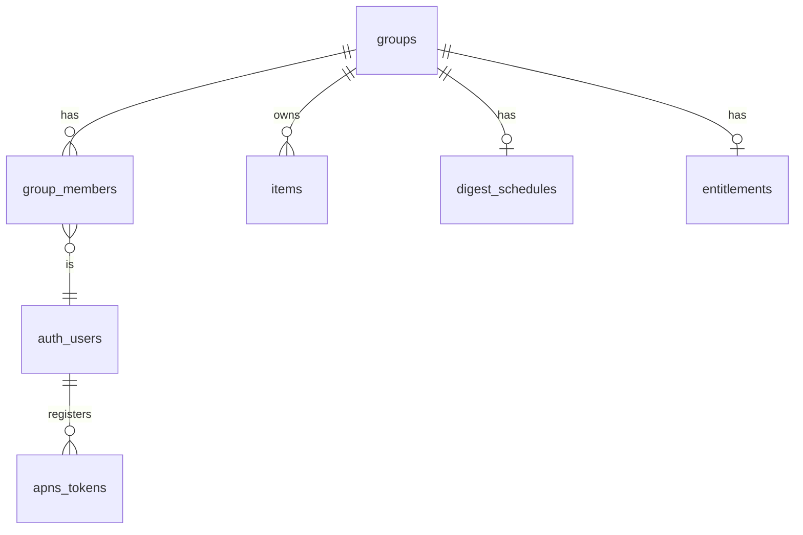

# Launch-Ready Transition Plan

Transition CanWeGo from a two-person allow-listed app to a launchable product:
group-based data model (solo to 4 people), Sign in with Apple/Google, a
5-items-per-category free tier with a subscription unlock, city editions, and
the surrounding launch essentials — without disturbing the existing Can +
Joyce library.

*Drafted 25 Aug 2026, all product decisions resolved. Execution not started —
current build iteration continues first.*

## Where we are (verified against the code)

The backend is a single shared pool: an email allow-list (`public.members`)
gates everything via `is_member()` RLS — every member sees every item. There
is no household/group concept, but nothing is hardcoded to two people either:
"notify partner" already means "every device except the saver's"
(`supabase/functions/_shared/notify.ts`), and `added_by_email` is attribution
only. Auth is email/password with signup disabled. That makes this a clean
transition: introduce a group axis, scope everything to it, and put sign-up,
limits, and payments around it.

## Target model

Every new user gets a **personal group of one** at sign-up — solo use is just
a group of one, no special case. Others join by invite code/link, capped at 4
members. One member's subscription unlocks the whole group (right for
couples/friends, and Family Sharing-friendly).

**Group size is part of the pricing**: solo and couples (2 members) are free;
the third and fourth member require the group to have Plus. This keeps the
core couple story — and the invite-driven growth loop — free, while
monetizing bigger groups, who are also the heavier LLM users.

## Phase 1 — Groups in the database (invisible to you two)

- New migration: `groups` (including `city` and `timezone`, defaulting to
  London/Europe/London), `group_members` (user_id, group_id, role),
  `entitlements` (group_id, tier, source, expires_at); add `group_id` to
  `items`, replace the singleton `digest_schedule` with per-group rows; key
  `apns_tokens` by user.
- **City editions**: the app stays local — each group belongs to exactly one
  city, chosen from a curated list. A `supported_cities` config table carries
  display name, timezone, geocode suffix, default map camera, and a sample
  link for the guided first save. The LLM prompts
  (`supabase/functions/_shared/extract.ts`, `locate`, `suggest`), the
  geocoder (which appends ", London" today), and the digest scheduler all
  read city/timezone from the group instead of hardcoding. This works cheaply
  because the app has no editorial content — a city is parsing context plus
  timezone plus map default, nothing more.
- **Launch cities (6)**: London, New York, Paris, Berlin, Amsterdam,
  Barcelona — big cities where the model's venue knowledge is deep. Expanding
  is adding a config row (plus a QA pass for non-Latin-script cities like
  Tokyo).
- City is picked in onboarding and changeable in My group (a move only
  changes parsing context and map default; saved items keep their
  coordinates).
- **City edge rules**:
  - Trip saves are first-class: the geocoder appends the city suffix only
    when the address doesn't already name a city, and trusts an out-of-city
    result that matches the address (a Paris save from a London group pins in
    Paris, never force-pinned home). Data is never blocked for being out of
    city.
  - Geocode suffixes are disambiguated in config ("Paris, France",
    "Barcelona, Spain", "New York, NY").
  - The digest cron evaluates each group's send time in its own IANA
    timezone — DST shifts on different weeks per city, so never a fixed
    offset.
  - Distance chips on place cards hide beyond ~100 km (a traveling member
    shouldn't see "5,562 km away" on every card).
  - The city list and each city's guided-first-save sample link live in
    `supported_cities` (server-side), so links can be refreshed and cities
    added without an app release; sample links use evergreen venue pages, not
    time-limited exhibitions.
  - Prompt examples localize lightly per city (price example "£12" →
    "€12"/"$12").
  - App UI stays English-only at launch; the LLM already reads
    foreign-language venue pages and summarizes in English. Localization is
    post-launch.
- Rewrite RLS from `is_member()` to `is_in_group(group_id)` on items and
  friends; membership-count trigger enforces the 4-person cap.
- **Data migration**: create the "Can & Joyce" group, backfill `group_id` on
  all existing items, move your digest schedule into it, and seed a comped
  `founder` entitlement so you're never limited.
- Update edge functions that use the service role to scope by group:
  `supabase/functions/_shared/notify.ts` (notify group members, not "all
  tokens"), `supabase/functions/send-digest/index.ts` (loop groups, one
  digest per group on its own schedule), `ingest`, `calendar`, `suggest`.
- iOS sync (`ios/CanWeGo/Support/SupabaseSync.swift`) sends/receives
  `group_id`; the app keeps working identically for you throughout.

## Phase 2 — Accounts: Sign in with Apple + Google

- Supabase natively supports both: native `ASAuthorizationController`
  (Apple) and Google sign-in produce an identity token exchanged at the token
  endpoint (`grant_type=id_token`) — this drops straight into the existing
  session machinery in `ios/CanWeGo/Support/SupabaseAuth.swift`. Enable
  providers + signup in Supabase; keep email/password working so your current
  accounts are untouched.
- Note: offering Google makes Sign in with Apple **mandatory** (App Review
  rule), so both ship together.
- On first sign-in: create the personal group, then onboarding — a short
  welcome, set your display name, **pick your city** (from the six), "start
  solo or join with a code", notification permission priming. Joining a group
  by invite skips the city step — you inherit the group's city.
- **Guided first save**: onboarding ends by walking the new user through
  parsing one real link (with the chosen city's sample link offered if they
  don't have one handy) — they reach the library with a card already in it
  and the core loop already understood. Proper empty states behind that for
  the other tabs.
- **Identity note**: attribution moves from `added_by_email` to `user_id`
  internally — Apple's Hide My Email produces relay addresses, so emails stop
  being meaningful identifiers. Display names (set at onboarding) carry all
  user-facing attribution.
- **Duplicate accounts** (same person via Apple one day, Google the next)
  are accepted at launch — account linking is a post-launch feature; the
  stray account can be deleted in-app.
- **Account deletion in-app** (an App Review requirement): a delete-account
  edge function that removes the user, their memberships, and orphaned solo
  groups.

## Phase 2b — Inviting people and "My group"

A core simplifying rule first: **a user belongs to exactly one group at a
time.** No group switcher, no multi-group headaches — your library *is* your
group's library. Joining and leaving are moves between groups, never copies
of state.

### Inviting someone

- Entry points: a "My group" section at the top of Settings, plus a gentle
  nudge on the (otherwise empty) first-run library: "Using this together?
  Invite them."
- Tapping **Invite** creates an invite: a 6-character code (e.g. `KV7-P2M`)
  backed by a new `group_invites` table (code, group_id, created_by,
  expires_at, revoked). Codes live 7 days, are multi-use until the group is
  full (4), and are revocable from the same screen.
- The invite sheet offers the code big and copyable, plus a share-sheet
  message with a link: `https://canwego.app/join/KV7P2M`. The link is a
  universal link — if the app is installed it opens straight into the join
  flow; if not, it lands on a one-page site with the code shown and an App
  Store button. **Manual code entry always exists** (in onboarding and in My
  group → "Join a group instead"), so the flow never depends on deep-link
  plumbing working.
- The join screen shows what you're agreeing to before confirming: group
  name, member names, "You'll share one library — everyone sees and edits
  everything."
- **Free groups cap at 2 members.** Inviting a third shows the Plus upsell
  instead of a code ("Bring more people with Plus"); the membership edge
  function enforces the 2-free/4-plus rule at join time, never trusting the
  client.

### Joining when you already have saves

- Joining prompts one choice: **"Bring my saves"** (items you added move
  into the group — the default) or **"Start fresh"** (your solo items are
  archived server-side, restorable if you later leave). Your empty solo group
  is dissolved.
- Joining a free group whose categories are already at the 5-item cap: your
  items still come along (the cap gates *new* saves, never existing data).

### My group (top of Settings)

- **Group card**: editable group name, member list with initials-avatars and
  display names, a "Plus" badge on the subscriber, and member count (2 of 4).
- **Your name**: editable display name — this feeds "Added by …" on cards
  and the "X added: …" push notifications, replacing today's manually seeded
  `members.display_name`.
- **Invite someone** (visible while under 4 members) and **pending invite**
  row with revoke.
- **Roles, kept minimal**: the group's creator is *owner*; only the owner
  can remove a member and rename the group; everyone can invite and everyone
  can leave. If the owner leaves, ownership passes to the longest-standing
  member.
- **Leave group**: a confirmation sheet with the mirror of the join choice —
  **"Take my saves"** (items you added move with you into a fresh personal
  group, the default) or **"Leave them with the group."** Warnings shown
  inline: if you're the subscriber, the group loses Plus when you go; if
  you're the last member, the group and its items become your personal group
  (nothing is deleted).
- **The journal is memories, not inventory**: done/missed items the leaver
  added are **copied**, not moved — the leaver takes their history, and the
  group's "We Did Go" journal keeps every entry. Only active saves follow the
  adder exclusively.
- **Remove member** (owner only): the removed member's items stay with the
  group; they land in a fresh empty personal group. Their devices drop off
  the group's digest and save notifications immediately (both key off
  `group_members`).

### Edge rules worth locking down now

- Digest + "X saved …" notifications always derive recipients from
  `group_members` → `apns_tokens`, so join/leave/remove need no notification
  bookkeeping of their own.
- If the subscriber leaves, their entitlement follows them (it's bound to
  their Apple ID); the old group drops to free at the next entitlement check
  — over-cap categories keep their items but block new saves until under the
  cap or re-subscribed. Nothing is ever deleted by a downgrade.
- Same principle for members: a group of 3–4 that loses Plus keeps everyone
  (nobody is ever kicked by a downgrade) — it just can't add members or
  over-cap saves until it re-subscribes.
- All joins/leaves/removals run through a small `group-membership` edge
  function (service role) rather than raw client writes — it's the one place
  the invariants live: cap of 4, one-group-per-user, item moves, ownership
  handover, invite validation.

## Phase 3 — Free tier + subscription

- **Limit**: 5 *active* items per category per group (done/deleted don't
  count — feels fair and keeps the journal unbounded). It's a soft nudge by
  design — recategorizing to dodge it is accepted, not fought. Enforced
  server-side with a DB trigger (so the share extension and every client obey
  it), mirrored client-side with a friendly paywall sheet before the save
  fails.
- **Subscription** ("CanWeGo Plus"): **£2.99/month or £21.99/year, with a
  7-day free trial**. StoreKit 2 in the app; App Store Server Notifications
  v2 webhook → new edge function writes the group's `entitlements` row. The
  app checks entitlement locally via StoreKit and trusts the server row for
  cross-member unlock. If a member tries to subscribe in a group that already
  has Plus, the paywall says so instead of double-charging.
- **All AI features stay free** (parse, day-plan suggestions, location
  fix-up) — the free/paid line is capacity (items, group size), not
  intelligence. Cost protection comes from quotas instead:
- **LLM quota** in `supabase/functions/_shared/limits.ts`: **10 AI calls/day
  per free user, 50/day with Plus** — invisible in normal use, a hard wall
  for abuse. Counted per user across parse/suggest/locate, with a gentle
  "come back tomorrow" message at the limit.

## Phase 4 — Launch polish

- **Positioning**: "your city, planned together", with London as the
  marketing hero. **Available worldwide** — tourists planning trips are a
  real audience — with the six-city picker live at launch.
- Retire the PWA formally (push already only targets iOS); web repo stays
  as-is but unlisted. One small web surface remains: the one-page invite-link
  landing site.
- Legal/App Store: privacy policy + terms URLs, App Privacy nutrition labels
  (accounts, location-when-in-use, photos), screenshots, description.
- **Analytics: Apple-only** — Xcode Organizer crashes and App Store Connect
  metrics, no third-party SDKs; the privacy label stays minimal.
- **External TestFlight beta** for a few weeks before launch, with the real
  paywall active (no comped Plus for testers — they test the purchase flow
  too; TestFlight makes StoreKit purchases sandbox/free anyway, so nobody
  actually pays during beta).
- Ops: upgrade off the Supabase free tier (auth email limits already bit you
  once) and production APNs key check.

## What stays untouched

The existing Can + Joyce library, history, digest, and sign-ins keep working
through every phase — Phase 1's migration is the only moment the data is
touched, and it's a backfill, not a rewrite. The founder entitlement means
the paywall never appears for the founding group.

## Suggested order

Phases are sequential (1 → 2 → 3 → 4); each leaves the app shippable to
TestFlight, so daily use continues while it transforms.

## Checklist

### Phase 1
- [ ] Groups schema (incl. city/timezone), RLS rewrite, Can+Joyce backfill migration
- [ ] `supported_cities` config table with the six launch cities
- [ ] Scope edge functions (notify, digest, ingest, calendar, suggest) by group
- [ ] City/timezone plumbed through prompts, geocoder, digest scheduler
- [ ] iOS sync carries `group_id` end to end

### Phase 2
- [ ] Sign in with Apple + Google via Supabase id_token exchange
- [ ] Onboarding: personal group, display name, city picker, notification priming
- [ ] Guided first save with per-city sample link
- [ ] Invite flow: codes + universal link, join screen, bring-my-saves choice
- [ ] My group in Settings: members, rename, invite/revoke, leave, remove
- [ ] `group-membership` edge function holding all join/leave/remove invariants
- [ ] In-app account deletion (App Review requirement)

### Phase 3
- [ ] 5-active-items-per-category cap: DB trigger + paywall sheet
- [ ] CanWeGo Plus (£2.99/mo, £21.99/yr, 7-day trial): StoreKit 2 + server notification webhook + group entitlements
- [ ] Per-user daily AI quota (10 free / 50 Plus) in limits.ts

### Phase 4
- [ ] Legal pages, App Store assets, privacy labels
- [ ] Invite-link landing page
- [ ] Supabase paid tier + production APNs check
- [ ] External TestFlight beta, then launch
